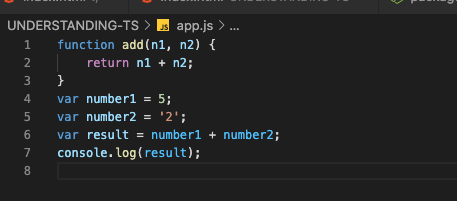

# Using Types

### WHAT core types Typescript and Javascript both supports

Typescript provides many types to Javascript. Compared to Javascript,

* Typescript adds many more types
* Typescript enables you to write your own types

Let's start with some of the core types which Javascript already knows and which typescript all supports.

| Type | Example | Description |
| :--- | :--- | :--- |
| **number** | 1, 5.4, -10 | All numbers, no differentiation between integers or floats |
| **string** | 'Hi', "Hi",  \`\` | All text values. |
| **boolean** | true, false | Just these two, no "truthy" or "falsy" values |


The **back takes** is a special syntax provided in modern javascript and also in typescript which allows us to write so called template liberals that are normal strings where you can dynamically inject some data into them.


### WHY we need to use type - simple add function use case

Now I want to develop a function to add two variables. The program does not know the source of the variable, that means, these variables could come from any sources like form input, or called by another function.

```typescript
function add(n1, n2) {
    return n1 + n2
}
```

If we are passing two regular number, the following test case will return 7.8 as expected.

```typescript
// Test Case
const number1 = 5;
const number2 = 2.8
const result = add(number1, number2);
console.log(result);
```

If we are passing the first element as string, then we are getting another result unexpectedly. Reason is that this is not the result of the mathematical additions but instead this concatenated as a string.

```typescript
const string1 = '5'
const number2 = 2.8
const result = add(string1, number2);
console.log(result); //we are getting 52.8
```

### HOW we can use type

Now if we add the type in the function definition, it will throw error in the IDE

```typescript
function add(n1:number, n2:number) {
    return n1 + n2;
}
```


Typescript's type system ONLY helps you **during development** \(before the code gets compiled\). That means, when you run `tsc app.ts` The compilation still passes. The following screenshot is the `app.js` after compilation  




